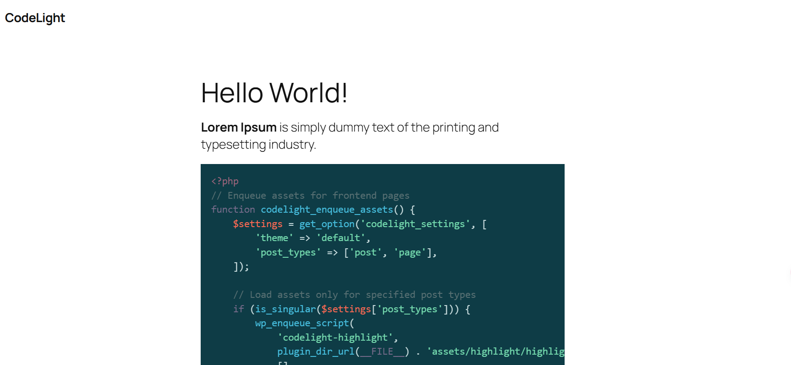

    

**Codelight** is a WordPress plugin that integrates syntax highlighting into your posts and pages using [Highlight.js](https://highlightjs.org/). It allows you to choose from a variety of themes and customize syntax highlighting for code blocks. The plugin is easy to configure, providing an admin settings page where you can select the syntax highlighting theme and decide on the post types for which the highlighting should be enabled.

## Features

- **Syntax Highlighting**: Adds syntax highlighting to code blocks in your WordPress posts and pages.
- **Customizable Themes**: Choose from a range of themes available for Highlight.js.
- **Post Type Configuration**: Enable syntax highlighting for specific post types (e.g., posts, pages, custom post types).
- **Dynamic Theme Switching**: Change the Highlight.js theme dynamically on the admin page and in the front-end.

## Library Used

- **[Highlight.js](https://highlightjs.org/)**: A lightweight and fast syntax highlighter for the web. It supports over 190 languages and comes with a wide variety of themes. The plugin integrates this library to automatically detect and highlight code blocks in your content.

## Installation

1. **Download** the plugin from the WordPress plugin repository or upload the plugin's folder to your `wp-content/plugins` directory.
2. **Activate** the plugin through the "Plugins" menu in WordPress.
3. Go to **Settings** → **Codelight** to configure the plugin settings. You can select the Highlight.js theme and specify the post types where you want the syntax highlighting to be applied.

## How to Use

1. After activating the plugin, go to the **Codelight Settings** page from the WordPress admin menu.
2. Choose the **Highlight.js Theme** from the dropdown menu. The available themes will be listed based on the installed files.
3. Optionally, you can select which post types should have syntax highlighting enabled (e.g., posts, pages, etc.).
4. On the front-end, wrap your code inside `<pre><code></code></pre>` blocks, and Highlight.js will automatically apply syntax highlighting.